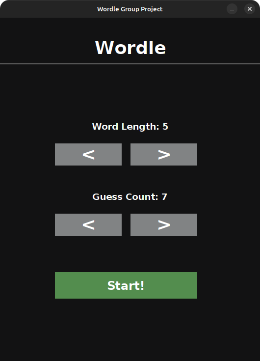
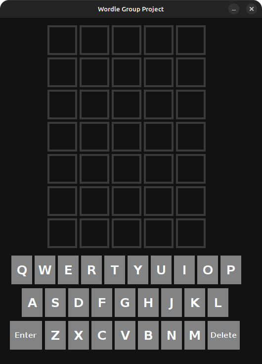
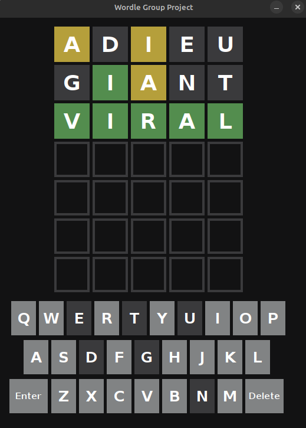
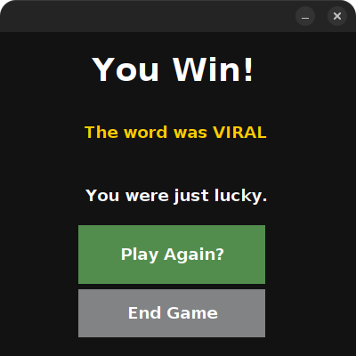

[Back to Portfolio](./)

Wordle Group Project
===============

-   **Class: CSCI 325 Object-Oriented Programming** 
-   **Grade: A** 
-   **Language(s): Java** 
-   **Source Code Repository:** [Wordle Group Project](https://github.com/koimcf2005/WordleGroupProject)  
    (Please [email me](mailto:kemcfarland@student.csuniv.edu?subject=GitHub%20Access) to request access.)

## Project description

Lorem ipsum dolor sit amet, consectetur adipiscing elit, sed do eiusmod tempor incididunt ut labore et dolore magna aliqua. Ut enim ad minim veniam, quis nostrud exercitation ullamco laboris nisi ut aliquip ex ea commodo consequat. Duis aute irure dolor in reprehenderit in voluptate velit esse cillum dolore eu fugiat nulla pariatur. Excepteur sint occaecat cupidatat non proident, sunt in culpa qui officia deserunt mollit anim id est laborum.

## How to compile and run the program

---

### 1. Verify Requirements

-- Install NetBeans 20+ (or any version supporting JDK 21).  
-- Install JDK 21 and set it as a recognized Java Platform in NetBeans.  

The project requires Java 21 because the properties file includes:  
`javac.source=21` and `javac.target=21`.

---

### 2. Import the Project into NetBeans

1. Start NetBeans.  
2. Go to **File → Open Project**.  
3. Select the **WordleGroupProject** directory (the one containing nbproject/).  
4. NetBeans will detect it as an **Ant Java Project**.  
5. Click **Open Project**.

---

### 3. Set the Java Platform

Right-click the project → **Properties** → **Libraries**.
Choose **JDK 21** as the active platform.  

---

### 4. Build and Run the Project

#### Build  
Right-click the project → **Build**  

#### Run  
Right-click the project → **Run**.

---

### 7. Clean the Project

Right-click → **Clean**  

---

### 8. Running the JAR Manually

After building, you can run the program from a terminal:

`java -jar dist/WordleGroupProject.jar`

---

## UI Design

Almost every program requires user interaction, even command-line programs. Include in this section the tasks the user can complete and what the program does. You don't need to include how it works here; that information may go in the project description or in an additional section, depending on its significance.

The user begins on the home screen, where they can customize the game's difficulty by selecting the desired word length (typically between 4 and 11 letters) and the maximum number of guesses allowed (usually 4–10 attempts) (see Fig 1). After confirming their settings and pressing "Start," the game board appears with a blank grid ready for input (see Fig 2). 

During gameplay, the user types a guess using the on-screen or physical keyboard and submits it. Each letter tile is immediately color-coded: green for correct letter in correct position, yellow for correct letter in wrong position, and gray for letters not in the target word. This process repeats until the user either correctly guesses the word or runs out of attempts (see Fig 3). 

Upon winning (or losing), a results screen appears displaying the target word, the number of attempts used, and two buttons: "Play Again" to start a new game with the same settings, and "Quit" to return to the home screen or exit the application (see Fig 4).

  
Fig 1. The home/customization screen where word length and number of attempts are chosen.

  
Fig 2. The empty game board at the start of a new game.

  
Fig 3. The game board during active play, showing color-coded feedback after several guesses.

  
Fig 4. The win/results screen with "Play Again" and "Quit" options.

## Additional Considerations

This project is a Windows-only executable and does not run on macOS or Linux.

[Back to Portfolio](./)
